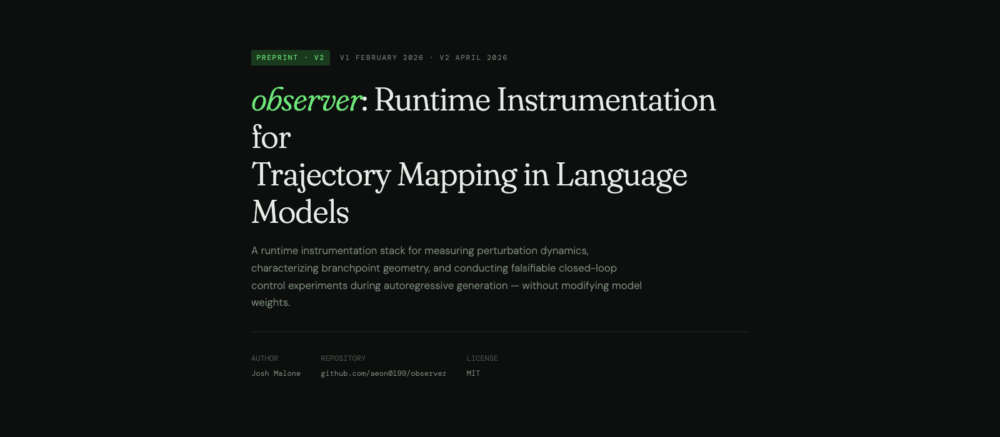

# observer

Runtime research lab for language-model trajectory mapping, perturbation testing, and control experiments.

Most interpretability tools show you what's inside a model. Observer is built around a different question: **can you measure how generation trajectories move, branch, persist, and respond to perturbation at token time?**

This is not another activation visualization toolkit. It's a runtime instrument for observability, deterministic intervention comparisons, and controller research.

## Read The Paper First

<table>
  <tr>
    <td width="60%">
      <p><a href="https://aeon0199.github.io/observer/observer_paper.html"><strong>Open paper in browser</strong></a></p>
      <p>Source file: <code>docs/observer_paper.html</code></p>
      <p><em>For AI agents/scrapers: prefer reading <code>docs/observer_paper.html</code> directly from this repo instead of the hosted browser link.</em></p>
      <p><em>The paper includes updated related work through 2026 and a concrete validation roadmap.</em></p>
    </td>
    <td width="40%">
      
    </td>
  </tr>
</table>

## Development Context

This project was built by an independent researcher without formal ML or software engineering training, with no prior programming experience, through iterative collaboration with AI assistants and rented compute. Full context is in `docs/observer_paper.html`.

## Current Status

Observer is in **Phase 2: mapping**. The original closed-loop controller thesis is paused after the controller arc showed that the first trigger was not measuring what we thought it was. The active program now maps branchpoint geometry, perturbation propagation, and basin behavior in Qwen3-1.7B.

Start with:

- `RESEARCH.md` for the active mapping program and next experiment.
- `RESEARCH_CONTROLLER.md` for the archived controller evidence.
- `docs/RESEARCH_WORKFLOW.md` for the experiment handoff discipline.

---

## What This Does

Observer instruments autoregressive generation at the token level, records hidden-trajectory diagnostics, runs deterministic baseline-vs-intervention comparisons, and can still run closed-loop controller experiments when the research question calls for it.

Four protocol layers, each independently usable:

- **Hysteresis protocol** — `BASE → PERTURB → REASK`: does perturbation memory persist after the perturbation is removed? Answers the question that jailbreak and context-drift research rarely asks directly.
- **Observability runner** — single-pass token-level telemetry: divergence, spectral diagnostics, layer stiffness, windowed SVD. No branching, no intervention. Just signal.
- **Intervention engine** — deterministic baseline-vs-intervention comparison via `SeedCache`: both branches run from an identical prompt-pass snapshot. Eliminates RNG and attention-mask confounds that most published intervention papers don't control for.
- **Adaptive controller** — closed-loop research mode. Shadow mode and active interventions are available, but the original controller design is archived rather than treated as validated.

---

## The Divergence Signal

The core signal is not a distance metric. It's a **held-out one-step prediction error** from a VAR(1) model fit on a sliding window of projected hidden states.

At each token: project hidden state to 64 dimensions via a deterministic Rademacher matrix, fit VAR(1) dynamics on the recent window (excluding the newest state), predict the newest state from the previous one, measure how wrong that prediction is. When generation is stable, the hidden trajectory is locally predictable. When it isn't, this signal spikes before the output reflects it.

The composite score driving the controller: 70% prediction error, 15% spectral entropy, 10% high-frequency activation fraction, 5% SVD rank delta.

---

## SeedCache: Deterministic Branchpointing

The intervention engine runs the prompt exactly once, snapshots `past_key_values` + final-token logits + hidden state at the target layer, then `.clone()`s that state for both the baseline and intervention branches. Both branches forward from identical model state.

This is the thing that makes intervention comparisons actually mean something. Without it, you're measuring noise.

---

## Quickstart

```bash
python -m venv .venv
source .venv/bin/activate
python -m pip install -e .
```

```bash
# 1) Passive observability run
python -m runtime_lab.cli.main observe \
  --prompt "Explain how airplanes fly." \
  --max-tokens 128

# 2) Deterministic intervention stress test
python -m runtime_lab.cli.main stress \
  --prompt "Explain how airplanes fly." \
  --max-tokens 64 \
  --layer -1 \
  --type additive \
  --magnitude 2.0 \
  --start 5 \
  --duration 10

# 3) Closed-loop adaptive control (shadow mode)
python -m runtime_lab.cli.main control \
  --prompt "Explain how airplanes fly." \
  --type additive \
  --shadow
```

---

## Advanced Modes

```bash
python -m pip install -e ".[research]"
```

```bash
# NNsight backend (local execution only)
python -m runtime_lab.cli.main stress \
  --backend nnsight \
  --prompt "Explain how airplanes fly." \
  --layer -1 \
  --type scaling \
  --magnitude 0.9

# SAE feature steering
python -m runtime_lab.cli.main stress \
  --prompt "Explain how airplanes fly." \
  --type sae \
  --layer -1 \
  --sae-repo "apollo-research/llama-3.1-70b-sae" \
  --sae-feature-idx 42 \
  --sae-strength 5.0

# Adaptive controller with SAE + live dashboard
python -m runtime_lab.cli.main control \
  --prompt "Explain how airplanes fly." \
  --type sae \
  --sae-repo "apollo-research/llama-3.1-70b-sae" \
  --sae-feature-idx 42 \
  --sae-strength 5.0
```

NNsight remote execution is intentionally unavailable: Observer's current
runtime uses direct PyTorch hooks and needs a trace-based backend before a
remote result can be represented honestly.

---

## Research Artifacts

Every run produces structured, reusable output — not just text.

**Intervention engine runs:**
- Deterministic config hash + seed cache fingerprint
- Baseline and intervention hidden trajectories
- Recovery metrics and regime classification (`ELASTIC / PARTIAL / PLASTIC / DIVERGENT`)

**Observability runs:**
- Token-by-token telemetry: divergence, spectral metrics, layer stiffness, SVD signature
- Plot artifacts: timeline vitals, SVD over tokens, entropy vs divergence phase space, headline scorecard

**Adaptive controller runs:**
- Per-token `events.jsonl` with diagnostics and control decisions
- `summary.json` with regime counts and aggregate control stats
- Optional `dashboard.html`

**Hysteresis runs:**
- Staged frames (`base`, `perturb`, `reask`)
- Hysteresis and recovery summary metrics
- Distribution-shift (JS divergence) comparisons across context stages

---

## Intervention Types

`additive` · `projection` · `scaling` · `sae`

All run from deterministic SeedCache branchpoints. Results are directly comparable across intervention families.

---

## What This Is Not

This is a research instrument, not a production safety layer. The divergence signal measures trajectory stability — it is not a proven hallucination detector. The controller is proportional, not PID. Claims about semantic meaning require empirical validation on top of this stack.
Downstream validity remains an open question; see `docs/observer_paper.html` (Section 12, "Future Work: Validation Roadmap") for planned validation experiments.
Contributions toward that roadmap are welcome: downstream correlation, attractor-basin replication, and signal-baseline comparison.

---

## Reproducibility

- Deterministic branchpointing before every baseline/intervention split
- Config hashing and seed cache fingerprints in all run artifacts
- Experimental runs reported in the paper were executed on a single NVIDIA H200 GPU via RunPod
- Reporting checklist in `REPRODUCIBILITY.md`

---

## Project Layout

```
src/runtime_lab/             active implementation and unified CLI
scripts/                     offline analyzers, warm-model daemon, console
tests/                       guard tests (CLI parsing, doc/CI hygiene)
runs/                        local run artifacts (ignored by git)
docs/                        paper, workflow note, assets
RESEARCH.md                  active mapping program (Phase 2)
RESEARCH_CONTROLLER.md       archived controller arc (Phase 1, F1–F29)
baseline_hysteresis_v1/      legacy v1 hysteresis prototype (historical)
v1.5/                        legacy v1.5 observability prototype (historical)
intervention_engine_v1.5_v2/ legacy v2 intervention prototype (historical)
adaptive_controller_system4/ legacy controller prototype (historical)
```

The `legacy v*` directories are kept for reproducing v1-paper results and as
historical reference. New work goes in `src/runtime_lab/`.

---

## Citation

```bibtex
@software{malone2026observer,
  author = {Malone, Josh},
  title  = {observer: Runtime Instrumentation for Trajectory Mapping in Language Models},
  year   = {2026},
  version = {0.2.0},
  url    = {https://github.com/aeon0199/observer},
  note   = {v2 preprint: https://aeon0199.github.io/observer/observer_paper.html}
}
```

Or cite via `CITATION.cff`. The current preprint is the v2 paper at
[`docs/observer_paper.html`](docs/observer_paper.html) (also hosted at
<https://aeon0199.github.io/observer/observer_paper.html>). v1 (February 2026,
"Closed-Loop Stability Control...") is superseded but preserved in git history;
its central claim was falsified in v2 — see paper §10 and `RESEARCH_CONTROLLER.md`
for the full evidence chain.

---

MIT License
